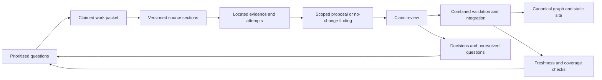

# Research coordination system

Status: proposed design, 2026-10-10. None of the records, queue operations, leases, or review gates specified here is implemented. The current manual workflow remains in [AGENT-WORKFLOW.md](AGENT-WORKFLOW.md). [SYSTEM.md](SYSTEM.md) owns historical semantics; this document owns the proposed research and coordination contracts; [ROADMAP.md](ROADMAP.md) owns delivery order and acceptance gates. These contracts apply equally to human and agent contributors.

## Objective and completion

Optimize the cost of resolving a well-scoped historical question with reusable evidence. A useful result can be a supported node or link, a correction, an explained rejection, or a bounded unresolved question. Node count, source reads, and agreement between agents do not measure historical accuracy.

Maintain two separate graphs. The public capability graph describes historical contributions. The work dependency graph describes which investigations or implementation tasks must finish before another task can proceed. Dependencies between research tasks never become historical links. A circular work dependency is diagnosed and split into smaller questions or one bounded joint investigation.

An expansion cycle ends when its selected questions have durable outcomes, accepted proposals have been integrated and checked, and remaining work has a concrete next action. No cycle means "finish Wikipedia." A resumed worker should need a compact task packet and saved records, without a conversation transcript.

## Authority and storage

The canonical node and edge files remain the authority for the graph. A proposed `research/` directory will hold validated editorial records in Git. Use separate records with opaque IDs and deterministic path sharding by ID prefix; workers should not rewrite a shared growing JSON array. Full article bodies and rebuildable search indexes remain in ignored cache. Do not put local absolute archive paths in portable records: use an archive UUID plus a local configuration mapping to its file.

The initial index is derived from the registered graph and research files using the existing Node/Python environment. Add a persistent local index only after measuring a need; it must be reconstructable and keyed by content digests. The public Svelte site consumes a bounded static projection and never requires the research store, Wikipedia archive, coordinator, or an account.

| Authority | Owns | Does not establish |
| --- | --- | --- |
| Git graph and research snapshot | Accepted records, decisions, proposal receipts, historical task outcomes | A global lock across independently cloned repositories |
| One active coordinator | Task leases, assignment order, integration serialization | Historical truth or permission beyond the user's scope |
| Worker workspace/proposal | Draft evidence, edits, and resumable findings | Admission to the accepted graph |
| Derived index/cache | Fast lookup and extracted text | New evidence, editorial assessment, or completeness beyond its manifest |
| Static publication manifest | Exact graph/evidence/media projection and checks | That all legacy claims have been reviewed |

Local coordination state can live in ignored `.cache/coordination/` with an atomic store and journal. That state is not rebuildable during an active run: retain it until a controlled shutdown. Git stores the durable task outcomes and receipts, not every heartbeat. Loss of live lease state requires stopping dispatch and recovering the coordinator epoch before issuing new leases.

## Record contracts

All proposed records have `schemaVersion`, stable `id`, a revision/digest, creator identity, and references to related IDs. Human timestamps support audit; semantic identity is based on canonical content, not time. Revision and supersession preserve earlier decisions. Unknown schema versions or fields must fail explicitly rather than disappear during round trips.

| Record | Minimum durable contents | Identity or scope rule |
| --- | --- | --- |
| Source version | Archive UUID, canonical article path/title, redirect aliases, canonical URL, provenance/license, extractor version and text digest | Within an archive, key by UUID plus resolved path; section redirects retain a separate locator. Cross-archive matches require recorded mapping, not title equality alone. |
| Reading attempt | Question ID, source-version ID or failed lookup query, actual sections/locators returned, actor, outcome, next action, resource use if known | A title match, returned passage, human inspection, and claim assessment are separate events. Duplicate receipts are idempotent. |
| Evidence | Source-version ID, section plus fallback text locator, passage digest, concise paraphrase, exact proposition supported or contradicted, caveats | Reference the passage, not merely the article title. Quotation is optional and short; retain attribution. |
| Claim review | Node/edge ID and exact field or proposition, evidence IDs, assessment, explanation, reviewer, reviewed-input fingerprint | Assess existence, date, scope, and contribution separately where their evidence differs. |
| Decision | Accepted/rejected/deferred alternative, subject IDs, evidence/review IDs, concise reason, superseded decision and reopening trigger | A rejected proposal is reusable knowledge; it does not prove a historical impossibility. |
| Work item | Precise question, expected outcome, subjects, dependencies, coverage tags, permitted writes/network scope, priority rationale, effort estimate, status and next action | Work dependencies refer to task IDs. Candidate articles are leads, not accepted nodes. |
| Proposal | Operation ID, work-item ID, base snapshot, expected record fingerprints, typed changes, evidence/reviews, affected subjects, author | A proposal may contain evidence-only work or several inseparable graph changes. No executable shell patches. |
| Integration receipt | Proposal IDs/revisions, before/after snapshots, actual edits, review dispositions, check results, output digests, recovery/commit identity | `passed`, `failed`, and `not_run` are distinct. A retry returns the same receipt. |

An article ledger is a view over source versions and reading attempts. It must answer "which sections did we inspect for which question, with what result?" It has no global `articleReviewed: true`. One article can support many milestones and can remain unexamined for other questions indefinitely.

Reading status distinguishes `located`, `passage_returned`, `lookup_failed`, and `read_failed`. Editorial assessment distinguishes `unassessed`, `supported`, `contested`, and `unsupported`. Freshness is `current`, `stale`, or `unknown`. Review disposition is separate from all three. "We did not find the claim in these sections" records search scope, not an unsupported verdict about the claim.

Lookup is read-only: it returns source identities and a receipt draft without modifying the public index or editorial status. Explicit cache population and attempt-recording are separate mutations. A worker records completed reads before yielding a checkpoint. A crash before that checkpoint leaves an incomplete attempt, not a fabricated visit; an unsaved read may be repeated. Human reads outside this interface are recorded explicitly or remain untracked.

Use one canonical alias resolution path, including bounded archive-local HTML redirects, loop detection, and explicit external-target refusal in offline mode. Cache keys include source version, extractor version, and section request. A new extractor does not silently turn old locators into current evidence.

## The work packet

A coordinator supplies the smallest packet sufficient to make a decision:

- Exact question and success condition; permitted operations; explicit time/token/read/network ceilings when supplied, otherwise a declared bounded research scope.
- Base graph/research snapshot and exact subject records, immediate parents/children, relevant alternate paths, and source-file locations. Large neighborhoods include counts and paging handles.
- Existing evidence, rejected alternatives, source conflicts, and why each could be reopened. Include original evidence references rather than copying whole notes.
- Candidate source sections and the reason to read them; duplicate milestone/alias matches; dependency results.
- Assigned task/actor, lease token and scope, designated reviewer, and the required handoff format.

Defaults are a depth-one neighborhood, 25 search hits, at most 50 returned neighbors, and a small number of source sections per retrieval. These bound output, not the graph: truncation and expansion handles must be visible. Measure and adjust these defaults during the pilot.

The worker returns a proposal or no-change finding, checked evidence, rejected alternatives, resource use when measurable, and a checkpoint containing the next useful action. It need not manufacture a node to complete its task. On budget exhaustion it saves a resumable checkpoint and releases the lease; it does not mark the question resolved. Topic expansion beyond the packet becomes a separate deduplicated candidate question.

Budgets belong to the work item and run, including retries, research, review, and integration; reassignment cannot reset them. The coordinator reserves capacity before dispatch and accounts for observed consumption at checkpoints. An exhausted ceiling defers the item or stops the run until explicitly extended within authorization. Unknown token/cost measurements remain unknown and require another enforceable bound, such as a deadline or maximum retrieval count. Pausing a worker inside an unfinished budget may return the item to ready; exhausting that budget may not.

## Choosing the next question

Use an explicit frontier of investigations, never a blind walk through article hyperlinks. Sources of work include user corrections; stale or contested reviews; named missing instruments, materials, experiments or institutions; orphan nodes with a specific input question; source conflicts; and underrepresented coverage cells. Isolation or a large date gap is a signal to investigate, not a defect to repair by adding a link.

Triage groups candidate questions by subject IDs, proposed contribution, date/place scope, and prior decisions. Shared titles alone are insufficient for deduplication. A `ready` item needs a concrete next source/query, a bounded success condition, satisfied work dependencies, and access within the task's authorization. Otherwise it remains `triage`, `blocked`, or `deferred` with a reason. A failed archive lookup must not monopolize repeated dispatch.

Initial scheduling policy, subject to pilot measurement:

1. Honor explicit user priorities within their budget and scope. An override records who selected it and why.
2. Otherwise use a repeating lane allocation of three repair/review assignments, two supported-expansion assignments, and one coverage assignment. Empty lanes lend slots to other lanes. This is a starting policy, not an empirically optimal ratio.
3. Within a lane, prefer higher impact class, more explicitly named dependent questions it can unblock (capped at 8), stronger evidence readiness (located relevant section before specific untried source before broad lead), more waiting rounds, and then lower estimated effort. Compare these fields lexicographically; use stable ID as the final tie-breaker. Impact classes are 3 for a documented error affecting multiple claims, 2 for one documented error or a named dependency blocking other research, 1 for a concrete supported candidate, and 0 for an exploratory lead. Record the justification, not just the number. Effort buckets are small, medium, large, then unknown; unknown is never zero cost. Calibrate their boundaries during the pilot.
4. A dispatch round is one completed six-slot lane cycle, recorded by the coordinator. On each lane's next allocation, if any item has waited five eligible rounds, select the longest-waiting such item before normal ranking, breaking ties by stable ID. Remove it from the waiting set on selection; record its new eligibility round if it returns. Blocked/deferred time does not count. User overrides still take precedence and their delay of aging items is visible.
5. Re-rank after a reviewed result changes dependencies, evidence, or scope. Identical queue snapshot, policy version, and recorded dispatch round produce identical recommendations and tie-breaks.

Show the components and alternative candidates with every recommendation. An unblocking count refers to named tasks; it is not a forecast of how many historical edges will be added. A contributor may challenge the ranking with a recorded reason. No opaque "historical confidence" score controls admission.

Coverage cells use explicit domain/era and, where evidenced, region/tradition tags. Unknown tags remain unknown; do not infer them from names. Report visited source versions, unanswered questions, supported/contested claims, and graph milestones separately. A coverage percentage requires an explicit, versioned candidate inventory and denominator. Do not report a percentage of "all technology" from node counts or ZIM entry counts.

For a four-worker session, start with a coordinator/integrator, two researchers, and a rotating reviewer. Roles can be combined over time, but an author cannot count as the independent reviewer of their own historical proposal. Assign at most one active work item per researcher and at most two pending historical proposals per reviewer; pause new dispatch when review is saturated. More parallel research should follow measured review capacity, not an arbitrary agent count.

## Work lifecycle and concurrent ownership

| Work status | Enter when | Exit or recovery |
| --- | --- | --- |
| `triage` | A candidate question is recorded | Ready after scope/dedup/source checks; supersede duplicates with a reference |
| `ready` | Dependencies and access permit a bounded investigation | Coordinator grants a lease and moves to active |
| `active` | One actor owns a live lease for this question | Submit to review; checkpoint and release to ready; defer or block with a reason |
| `review` | A sealed result/proposal revision is available | Request changes; resolve a reviewed no-change finding; approve an edit for integration |
| `integrating` | One integrator has an approved revision and write ownership | Resolve with a receipt, or return a stale/conflicting proposal for revision |
| `resolved` | Reviewed outcome is durable; edits, if any, have an application receipt | New evidence opens a linked follow-up, preserving the old outcome |
| `deferred` | Budget or evidence exhausted with a recorded next investigation | Reopen on new evidence, changed scope, or explicit selection; no automatic busy retry |
| `blocked` | A named external condition or dependency prevents progress | Recheck on that condition's change; failure to access a source is not evidence against a claim |
| `superseded` | Another item covers the question | Preserve redirect and prior findings; never count both as completed work |

A proposal separately moves through draft, submitted, changes requested, approved, applied, rejected, or stale. Rejecting a proposed edge does not automatically resolve its work question. Review records whether the question was answered or still needs investigation.

A lease contains task ID, actor ID, coordinator epoch, monotonically increasing fencing number, expiry, and expected task revision. The coordinator grants/renews/releases with an atomic compare-and-swap. Only the current fencing number can submit a result or update the task. Expiry returns unfinished work for reassignment; results from the old worker are retained as unaccepted drafts and require a fresh claim/rebase. Expiry never grants publication permission. Lease expiry uses the active coordinator's monotonic clock, never a worker's clock. Restart invalidates the old epoch through controlled recovery rather than trusting persisted monotonic timestamps.

Submission atomically records that the research lease was valid, seals the result, moves the task to review, and releases the research lease. Review and integration use their own ownership tokens; they do not require the researcher to keep renewing while waiting. An expired later assignment cannot retroactively invalidate an accepted submission. Any revision after submission needs a new authorized assignment and a new review disposition. Recovery checks historical authorization at submission and current ownership for the operation being attempted.

Use one coordinator for all participating checkouts. Git commits and branch names do not provide a distributed mutex. Remote/offline contributors receive assigned packets and return proposals; they cannot independently claim global exclusivity. A replacement coordinator stops dispatch, invalidates the old epoch under controlled recovery, and resumes from durable checkpoints. If the old coordinator cannot be fenced off, freeze canonical writes until ownership is settled.

Only the integrator writes accepted graph/research records and generated outputs. Workers use separate proposal directories or isolated worktrees; in the current shared-checkout fallback use explicitly disjoint files. The integration lock covers cooperating local writers only. Recheck files immediately before replacement; external editors and stale branches can still conflict.

## Admission and review

Every proposed node needs a distinct capability/institution/practice scope, supported existence and date interpretation, a duplicate/alias check, and a suitable existing branch/category. A biography event, article category, or extra chronological waypoint does not automatically qualify. Preserve uncertainty in current prose/year semantics until a richer date schema ships.

Every proposed link supplies a short contribution statement of the form: this specifically scoped parent supplied this instrument, material, method, observation, personnel, funding, or institutional arrangement to this target. It names supporting passages, explains date compatibility, and checks nearer intermediates and independently direct inputs. No hyperlink, shared subject, trial-before-factory chronology, or generic commercial demand proves a contribution.

All new or materially changed historical claims receive a second pass by an actor other than the author. Pure formatting and unchanged metadata need only appropriate mechanical checks. The reviewer reads the cited passage and endpoint scopes, evaluates contradictions and alternatives, and records a disposition against the exact proposal revision. A second model is not an independent historical source; multiple votes cannot resolve a source conflict. Further sources are justified by the claim's uncertainty, not a fixed citation quota.

Evidence-only and no-change findings are first-class reviewable results. Publication of a new claim requires a supported, current assessment; unresolved competing accounts remain in research until an explicit uncertain-claim presentation contract exists. Legacy catalog records remain visible as legacy/unassessed through migration, without pretending they passed the new gate. The gate applies to newly added or materially modified claims; unrelated legacy gaps must not force a full catalog rewrite.

Known disagreements go back with precise objections. An editor resolves them with evidence and a recorded rationale or leaves the proposal contested; no endless agent debate or silent majority acceptance. Independent direct contributions remain allowed even when a longer path exists.

### Freshness and affected reviews

A review fingerprint includes the proposition, parent and target identities/scopes/date interpretations, relationship type and explanation, evidence source/extractor/passage identities, and relevant alternate-path witnesses. Source drift, endpoint changes, or a newly relevant intermediate can make it stale. Formatting, camera movement, and unrelated image metadata do not.

Endpoint/evidence reverse indexes identify obvious affected reviews. For graph changes, recompute directness/alternate-path diagnostics on the proposed combined graph and compare affected neighborhoods with reviewed witnesses. Until an incremental impact implementation is proven against a full scan, use the complete audit as an oracle. If the relevant review set cannot be bounded safely, mark the affected component conservatively and report that uncertainty. A stale review must never continue to suppress a flag just because its old explanation string still exists.

## Integration and recovery protocol

1. Use sealed proposal revisions. Check recorded authorization at submission, current integration ownership, allowed operation types, subjects, evidence references, source availability, and the expected read/write fingerprints. Readers see identified snapshots, not files midway through an application.
2. Group proposals by overlapping subjects and review dependencies. Detect conflicting claims, duplicate milestones under aliases, repeated source/target pairs, and cross-proposal cycles. Disjoint files can still contain conflicting semantics.
3. Build one staged snapshot of graph, research records, and dispositions. Preserve unrelated working-tree changes. Rebase only through an explicit recalculated proposal; stale fingerprints cannot silently apply. The full staged snapshot receives structural and historical review gates.
4. Run source validation, directness audit, compilation, data validation, relevant tests, and publication checks against that snapshot. Changed references receive focused source/image checks; historical evidence and live media provenance stay separate. No validation run may invoke research downloads implicitly.
5. Under exclusive integration ownership, recheck the source snapshot, journal intended file digests, apply atomic per-file replacements, and mark the transaction committed only when the complete set is present. Multiple renames are not one atomic transaction. Readers/publication refuse an incomplete transaction or use the previous committed snapshot.
6. Record before/after identities, dispositions, checks, and generated-output digests in the receipt. Commit only owned edits using the Git CLI. Record commit identity outside the content fingerprint to avoid a self-referential hash. Publish only the artifact matching the accepted receipt under the user's existing authorization.
7. On crash, recover by comparing journaled old/new digests. Restore only files still equal to the transaction's writes; otherwise preserve the user's edit and report a conflict. Replaying an applied operation returns its original receipt without adding another edge. An interrupted push is checked against remote state before retrying.

Keep operation history limited to recoverable editorial transactions. This design does not call for a general event bus, hosted database, or continuously running scheduler. Preparing a roadmap does not authorize background jobs or new external messages.

## Migration and proving the system

Start with a versioned ledger around existing files. Import the public offline index as availability-only records. Cached article files can seed extraction availability with known limits, but neither file presence nor a topic note automatically creates a supported review. Re-read a small pilot's passages and preserve the original notes as legacy evidence leads. Do not erase, retire, or renumber graph nodes during tooling migration.

The pilot must include both accepted and rejected outcomes from this repository:

| Fixture | Required outcome |
| --- | --- |
| Bacteria observation proposed directly for DNA heredity | Surface the prior scope objection and the nearer experimental route; do not recreate the shortcut |
| Vacuum pump used directly despite an alternate path | Retain its independent physical contribution with evidence |
| H4 1759 completion versus 1761-1762 trial | Separate scope/date claims; flag the trial date when used as a construction date |
| Undated lunar-distance chronometer checking | Record an unresolved date; do not invent 1767 from coexistence |
| H4 proposed as the timekeeper aboard a French voyage | Require evidence identifying the actual instrument or transfer |
| La Salle community followed by a normal school | Record the unproven personnel/model transfer; chronological proximity is insufficient |
| Cattermole patent, company formation, and 1905 process | Preserve the documented organizational contribution as separate from the process |
| Borough Road 1801/1809 accounts | Preserve conflicting founding/training scopes without false precision |
| Archive section redirect and a broken redirect | Resolve the former with locator; report the latter as access failure |
| Two workers rename/add the same milestone differently | Flag semantic duplication for review; do not publish both silently |
| Expired worker returns after reassignment | Refuse old fencing token and retain the draft for recovery |
| Proposals individually acyclic but jointly cyclic | Reject the combined snapshot before publication |
| Target date changes after review | Mark relevant assessment stale and require a new disposition |
| Image credit refresh or whitespace-only edit | Leave unrelated historical reviews current |
| Crash during multi-file apply; user then edits one file | Refuse unsafe rollback; preserve both recoverable versions |

Automated fixtures test record behavior, concurrency, invalidation, and failure recovery. Historical fixture verdicts are editor-curated expectations and must be rechecked if evidence changes; passing them does not prove historical truth. Test source extraction with small redistributable synthetic fixtures in CI, plus a local read-only smoke check against the real ZIM. CI must not require the 127 GB archive or network research.

Before scaling, complete a pilot of at least 12 bounded questions across three domains. Include at least four previously recorded no-change/rejected cases as reuse/regression checks, two deliberate worker interruptions, one changed source locator, and a combined-proposal conflict. New research has no acceptance or rejection quota; its outcome follows the evidence. Save question IDs, source snapshot, policy version, resource measures, reviewer dispositions, and unresolved issues. Re-run with a fresh worker to measure whether saved decisions are reused.

Measure median/p95 time and tokens per reviewed outcome where available, repeated retrieval of identical sections, time spent reconstructing context, duplicate task attempts, review rejection/rework reasons, queue age, reviewer backlog, regression recurrence, and coverage distribution. Report sample sizes; tail percentiles from this small pilot are descriptive, not reliable population estimates. Missing cost data is unknown, never zero. Compare equivalent tasks with warm/cold-cache conditions stated. Do not inflate throughput by splitting one claim into many trivial tasks or count deferred tasks as successful graph additions.

Release gates require zero silent duplicate applications, stale-lease writes, unreported truncation, or publication from an unvalidated snapshot in the failure fixtures. Every pilot outcome must resolve to its exact source sections or an explicit access limitation. A fresh worker must recover every seeded rejection and avoid presenting it as new work. Performance results are reported as measurements; the system is not called optimized merely because these documents exist.
