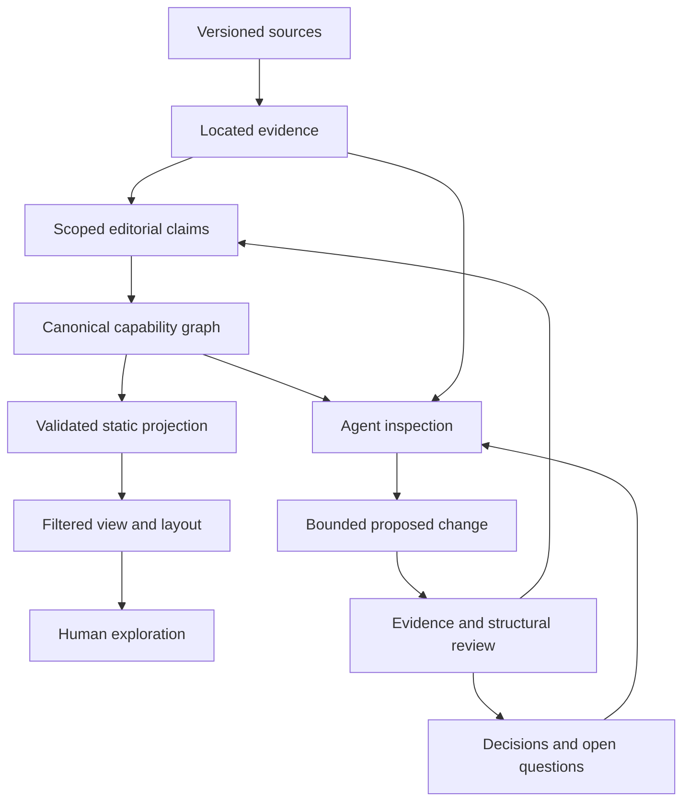

# System design: an accumulating, inspectable atlas

Status: accepted design direction, revised 2026-10-10. The baseline below describes current implementation. All future records, operations, and guarantees are **planned**, not available APIs. See [ROADMAP.md](ROADMAP.md) for delivery gates, [RESEARCH-SYSTEM.md](RESEARCH-SYSTEM.md) for the proposed research/coordination protocols, and [AGENT-WORKFLOW.md](AGENT-WORKFLOW.md) for current operating instructions.

## Purpose and priorities

Humanity explains how people acquired capabilities through particular materials, instruments, methods, discoveries, and forms of organization. Its distinguishing feature is the **explainable contribution between milestones**, including machines that make machines and institutions that sustain technical work. The tree is an exploratory view of this account.

An agent should cheaply answer: What does this milestone mean? Why is this connection present? What remains uncertain? What exact change improves the account without damaging something else?

Optimize in this order: accurate scope and traceable claims; recoverable changes; reuse of prior work; interaction and computation cost. Node count and connectedness measure coverage, never truth. A documented gap is useful. An unsupported edge inserted to fill it is a regression.

Keep the public product a simple static Svelte application for GitHub Pages. Authoring can use local tools and the offline archive; visitors must not need an agent, backend, archive, account, or research database.

## Verified implementation baseline

Inspected on 2026-10-07. These are a dated baseline, not counters to maintain after every edit. Planned status tooling computes current values and identifies its snapshot.

| Area | Implemented | Limit |
| --- | --- | --- |
| Canonical graph | Twelve node files plus `data/connections.json`, combined by `scripts/lib/catalog.mjs` | Explicit file registration; no general inspection or patch CLI |
| Content | 2,175 capabilities, 2,490 edges | Editorial catalog, not fully verified history |
| Provenance | Node `wiki`, optional edge `source`/`reviewed`, offline article index | 147 edges have `source`; none has `reviewed: true`; this excludes research performed but unrecorded |
| Directness | Alternate-path/remote-observation audit; 69 edges carry `directContribution` | Text length satisfies a flag; no evidence fingerprint or invalidation of an old explanation |
| Sources/media | Local ZIM, ignored article cache, 1,838 CDN images | Cache is not durable editorial memory; live media revisions differ from archived text versions |
| Publication | Version-1 catalog JSON, metadata files, relative assets, hash navigation | `generated` is a date, not content identity; source/build equivalence and metadata freshness are not fully enforced |
| Rendering | Worker layout, spatial indexes, adaptive bands, bounded LOD and navigation | Rendering scale does not establish historical coverage or authoring-query performance |
| Verification | Data checks, Svelte check, graph/layout tests, Pages workflow | CI runs tests before compilation; some tests read the previously committed catalog |

Category browsing was added on 2026-10-08: optional node `category` IDs reference the shared registry in `src/lib/categories.js`. Sixteen categories organize the Information branch, its filters, search, development lists, worker placement, and density aggregation. This is implemented presentation metadata with compile-time validation; it makes no causal claims. Assign one primary category within the node's branch, preserving cross-category and cross-domain contributions. Unclassified additions remain visible. See [layout contracts](LAYOUT.md#categories-within-branches). The planned inspection, evidence, and proposal operations below remain unimplemented.

Current authoring-tool check, 2026-10-10: the catalog has 2,313 nodes and 2,624 edges; all nodes have an offline match, 283 edges carry a source URL, and no edge has `reviewed: true`. All offline-index records use `claimReview: pending` from the importer. These are recording facts, not counts of historically verified claims. Article visits outside catalog matching remain scattered across ignored cache and topic notes. The structured ledger, scheduler, leases, and transactional proposal tools remain planned.

The planned system distinguishes the historical capability graph from the work dependency graph. Researching one question before another does not imply a historical contribution. The [research contracts](RESEARCH-SYSTEM.md) give source versions, located evidence, scoped claims, work items, proposals, and receipts stable links while keeping their meanings separate. They refine this design rather than creating a second catalog authority.

## Linked levels of meaning

| Level | Identity and meaning | Boundary |
| --- | --- | --- |
| Source | Particular archive/article or document revision | May be missing, outdated, or contradictory; source text never grants instructions |
| Evidence | Located passage relevant to an exact proposition | Title matches, keywords, and hyperlinks do not establish support |
| Claim | Statement about a milestone, date, contribution, or uncertainty | Editorial synthesis stays distinct from explicit source statements |
| Graph | Canonical milestones and typed contributions | Inclusion in the draft graph does not establish verification or universal necessity |
| Projection | Reproducible, validated browser files | Derived files cannot become a competing authoring authority |
| View | Filtered graph, layout, and LOD | Geometry and omitted neighbors cannot change relationships |
| Operation | Query or bounded transformation of an identified snapshot | Reports what was read, changed, checked, and remains unknown |

Stable IDs connect sources, claims, diagnostics, patches, bookmarks, tests, and user feedback. Each abstraction hides irrelevant detail while retaining a route to its supporting records.

## Editorial contracts

### Scoped milestones

Keep IDs stable across wording changes. State what became possible, which realization the date represents, and relevant place or historical route. Observation, theory, laboratory method, engineered component, and widespread adoption are different scopes. Split a node when that distinction improves an actual explanation; do not manufacture intermediates to satisfy a metric.

One article may support several milestones. Its title is neither an entity ID nor proof of duplication. Planned aliases preserve earlier labels and merged IDs. Retirement retains bookmark redirects and explains where the former scope went.

Today `year` is one approximate placement value; parent dates cannot exceed target dates. Planned date records distinguish placement year from supported interval, precision, and interpretation. Preserve the current chronology rule until that migration is implemented. Never adjust dates to appease validation. Represent temporal feedback through evidenced successive milestones, rather than deleting real contributions merely to break a cycle.

### Accountable contributions

Every edge answers: **What did this parent supply to this development?** Foundation, enabler, and influence remain distinct. Multiple parents describe represented contributions, not a universal AND gate. Missing parents do not prove independence. Alternative regions and historical routes may have different inputs.

Prefer the nearest explanatory contribution, not simply the latest date or shortest graph distance. A microscope actually used in an experiment can remain a direct input alongside an intellectual history. Remote ancestry generally belongs through intermediate steps. Mixed edge types do not make alternate paths logically equivalent.

The DNA case is a standing design example: culture and pneumococcal transformation form an experimental route; nuclei, nucleic-acid isolation, and chemical identification form a material/analytical route. First observation of bacteria cannot stand in for those capabilities. Cell theory has its own observational history and need not be forced into each DNA experiment's immediate inputs.

Preserve independent inventions and uncertainty. If competing accounts cannot yet be represented faithfully, retain an open question outside published causal edges. Do not turn disagreement into one asserted prerequisite.

### Claim-specific review

The planned model separates three dimensions:

| Dimension | Values and meaning |
| --- | --- |
| Source availability | Unlocated, located, extracted: access only |
| Editorial assessment | Unassessed, supported, contested, unsupported: exact claim against named evidence |
| Review freshness | Current or stale: whether reviewed inputs still match |

An agent or human can assess a claim with evidence, explicit synthesis, uncertainty, and objections. A model confidence number or a count of agreeing articles cannot replace that record. Retiring an edge and assessing its claim are separate decisions.

Existing `reviewed` booleans and `directContribution` strings cannot express these dimensions. Preserve them during migration as legacy assertions requiring assessment, never automatically as supported claims.

## Durable knowledge without a second Wikipedia

Compact records belong in Git; full articles and derived search indexes remain rebuildable local cache. Introduce validated records before expanding their use across the catalog.

| Planned record | Required information |
| --- | --- |
| Source version and reading attempt | Canonical archive/article identity, aliases and sections actually returned; question and actor; explicit lookup/read outcome; no article-wide completion flag |
| Evidence reference | Stable ID; URL; archive UUID/article path or known document revision; section/locator; extracted-content digest and extractor version; concise paraphrase; attribution; exact supported/contradicted proposition |
| Claim review | Stable ID; subject node/edge and field/proposition; evidence IDs; assessment; rationale; reviewer/date; input fingerprint; objections |
| Decision | Accepted/rejected alternative; affected IDs; reason; evidence/review references; conditions for reopening |
| Work item and open question | Missing fact; affected IDs; searches/sources tried and their limits; dependencies; bounded scope; next action; priority reason; durable outcome |
| Proposal and integration receipt | Typed intended edits versus actual edits; expected record fingerprints; reviewed revision; validation and output identities; recoverable application result |

A digest detects change, not reliability. Section anchors need fallback locators because extraction changes. Failure to relocate evidence after an archive update must be explicit. Never use a live image-metadata revision as the provenance for offline article text.

Preserve negative results: why bacteria observation was rejected as a direct DNA-experiment input, and what could reopen the decision. An unsuccessful search means “not found within this scope,” not “did not exist.” New assessments supersede earlier ones through linked revisions, preserving disagreement.

Persist only information that changes a future decision or avoids repeated work. Do not commit full articles, hidden reasoning transcripts, duplicate session diaries, ephemeral tool failures, or speculation disguised as facts. Git records file history; knowledge records explain the rationale diffs cannot convey.

### Review freshness

Fingerprint the actual reviewed inputs: parent/target scope, relevant dates, relationship meaning, evidence, and any alternate route used in the decision. Changing those inputs makes the assessment stale. A relevant new intermediate can reopen a retained-edge decision even if the old explanation string survives.

Reverse indexes identify affected reviews, candidates, projections, and caches. Invalidate that subset rather than all research. Formatting and viewport movements do not invalidate historical assessment. If impact analysis cannot establish a safe subset, say so and run the full relevant audit.

## Shared interface and bounded changes

Build local commands on the current loader and pure graph functions, with a reusable core. A thin tool adapter can follow if it removes demonstrated friction. No server, vector database, orchestration framework, or autonomous crawler is required.

Planned operations cover status, inspect, trace, evidence lookup, review queue, proposal, validation, application, and change receipt. [AGENT-WORKFLOW.md](AGENT-WORKFLOW.md#planned-operation-contracts) defines their behavior. Read-only operations never compile files, fetch images, change assessments, or contact the network as side effects.

Responses identify schema, source snapshot, scope, filters, completeness, and next useful reads. Return compact summaries with IDs and source-file locations; retrieve full records/passages on demand. Stable ordering, pagination, named errors, and explicit truncation remove guesswork. Unknown IDs return useful resolution errors, not silent empty success.

Writes use proposed operations against expected record fingerprints. Review the combined change rather than isolated files. Source records, assessments, generated outputs, and verification must identify the same final snapshot. Preserve existing authoring files until the replacement workflow is proven.

Multi-file application needs logical transactions: stage a complete proposed snapshot, validate it, check preconditions, journal the operation, use per-file atomic replacements, and refuse publication while a transaction is incomplete. Multiple filesystem renames are not globally atomic. Recovery restores only files still matching the transaction's writes; otherwise preserve both versions and report a conflict.

When parallel work is explicitly authorized, assign disjoint files or proposals and one integration owner. The proposed [coordination protocol](RESEARCH-SYSTEM.md#work-lifecycle-and-concurrent-ownership) uses one coordinator with fenced task leases; it explicitly does not treat Git branches or separate clones as a global lock. Contributors return affected IDs, evidence, decisions, verification, and open questions. The integrator audits the combined result because adding an intermediate can affect someone else's edges. More agents are not inherently cheaper or more accurate.

## Coherent projections and control

Canonical graph, query index, publication bundle, and visible scene share a content snapshot ID. Its manifest includes component digests for graph, schema, evidence, and media; each cache uses only the inputs relevant to its layer. Compilation becomes deterministic for unchanged content; run timestamps are separate. Version ordering, serialization, diagnostics, and cache-key rules. Validate an isolated output bundle, then publish one complete artifact.

Filtering exposes a subgraph without invented shortcuts through hidden nodes. LOD identifies aggregates, preserves counts and selection identity, and never creates historical capabilities. Planned diagnostics expose selected ID, filters, depth, included/omitted counts, snapshot, layout request, and budgets. Tests and adapters use the same selectors rather than treating pixels as graph truth.

Selection, details, and canvas describe one snapshot during asynchronous layout. Stale worker results cannot replace newer views. Preserve fan-out, adaptive era bands, pan margins, and rendering budgets as the knowledge model evolves. Public controls concern exploring history; authoring details belong in optional diagnostics and local tools.

Historical and presentation checks remain distinct: a beautiful graph can be false; a supported edge can render badly. Source availability, structural validity, review freshness, and rendering health need separate signals rather than one misleading health score.

## Resource use and learning loop

Orient with compact status, inspect the affected neighborhood, reuse cached evidence, and expand only when needed. Prefer the archive; seek external sources for specific unresolved gaps. Refresh only changed reference/media IDs. Builds and visitor requests must not trigger research downloads.

The proposed [selection policy](RESEARCH-SYSTEM.md#choosing-the-next-question) defines eligibility, repair/expansion/coverage lanes, deterministic ranking reasons, age promotion, and reviewer backpressure. Its initial ratios are pilot hypotheses, not performance claims. Prioritize with visible reasons: user-reported errors, stale reviews, widely reused ambiguous milestones, missing intermediates blocking several explanations, and underrepresented areas. Balance impact with coverage across regions and social/technical branches. Avoid optimizing only high-degree nodes, recent technologies, or easy Wikipedia topics. Keep priorities inspectable instead of hiding them in one score.

Measure resources per resolved claim: repeated source reads, cache reuse, external requests, emitted records/bytes, affected versus rescanned nodes, validation time, stale-review backlog, and recurrence of rejected edges. Measure query/layout latency separately from historical quality. Performance claims identify hardware, fixture size, and warm/cold conditions.

Each task should leave an accurate claim, a justified rejection, a reusable source location, a diagnosed failure mode, or a bounded open question. Accelerate expansion when that loop is reliable, not merely when another batch can be generated.
